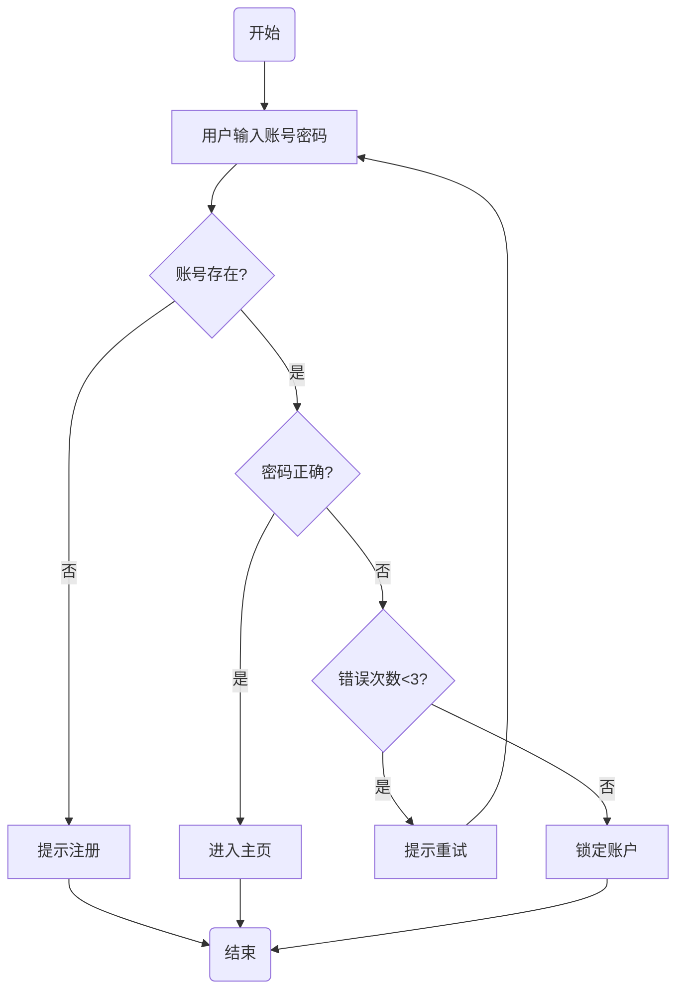

# Mermaid 流程图生成

> 用 AI 生成 Mermaid 代码 → 导入 draw.io 或 Mermaid Live → 可编辑的专业流程图。

## 流程总览

```
你的流程描述 → AI 生成 Mermaid 代码 → 导入 draw.io / Mermaid Live → 可视化 → 编辑美化
```

## 提示词模板

```
请将以下流程/逻辑整理成 Mermaid 格式的流程图代码。

要求：
- 使用 graph TD（从上到下）或 graph LR（从左到右）定义方向
- 决策节点使用菱形 { }，起止节点使用圆角 ( )，普通节点使用方括号 [ ]
- 节点文字简洁，不超过 15 字
- 只输出 Mermaid 代码块，不要任何额外解释

流程描述：

[这里粘贴你的流程描述]
```

## Mermaid 节点语法速查

| 形状 | Mermaid 语法 | 用途 | 示例 |
|------|-------------|------|------|
| 圆角矩形 | `A(文字)` | 开始/结束 | `Start(用户登录)` |
| 矩形 | `A[文字]` | 处理步骤 | `A[验证密码]` |
| 菱形 | `A{文字}` | 判断/决策 | `A{密码正确?}` |
| 圆形 | `A((文字))` | 连接点 | `A((API))` |
| 平行四边形 | `A[/文字/]` | 输入/输出 | `A[/读取数据库/]` |
| 子程序 | `A[[文字]]` | 预定义过程 | `A[[发送邮件]]` |

## 连线样式

| 样式 | 语法 | 用途 |
|------|------|------|
| 实线箭头 | `A --> B` | 正常流程 |
| 实线无箭头 | `A --- B` | 关联关系 |
| 带标签箭头 | `A -->|标签| B` | 标注流转条件 |
| 虚线箭头 | `A -.-> B` | 可选/异步流程 |
| 粗箭头 | `A ==> B` | 强调路径 |

## 导入 draw.io

1. 打开 draw.io（app.diagrams.net）
2. 菜单 → **排列 → 插入 → 高级 → Mermaid**
3. 粘贴 Mermaid 代码 → 确定
4. 流程图自动渲染
5. 手动调整布局：拖拽节点、调整连线路径、修改样式

## 在线预览（无需安装）

打开 https://mermaid.live：
- 左侧粘贴 Mermaid 代码
- 右侧实时预览
- 可导出为 SVG / PNG

## 完整示例

### 用户登录流程

**输入给 AI 的流程描述**：
```
用户输入账号密码 → 系统验证。如果密码正确则进入主页，密码错误则提示重试，
连续错误 3 次锁定账户。如果账号不存在则提示注册。
```

**AI 输出的 Mermaid 代码**：


## 更多流程图类型

Mermaid 支持的不只是流程图：

| 图表类型 | Mermaid 语法 | 导入目标 |
|---------|-------------|---------|
| 流程图 | `graph TD` | draw.io |
| 时序图 | `sequenceDiagram` | draw.io / Mermaid Live |
| 甘特图 | `gantt` | Mermaid Live |
| 类图 | `classDiagram` | draw.io / Mermaid Live |
| 状态图 | `stateDiagram-v2` | Mermaid Live |
| 饼图 | `pie` | Mermaid Live |

> **提示**：对于甘特图，推荐直接使用 draw.io 的甘特图模板而非 Mermaid，操作更灵活。

参考 [[../software/drawio-guide]] 了解更多 draw.io 操作。
