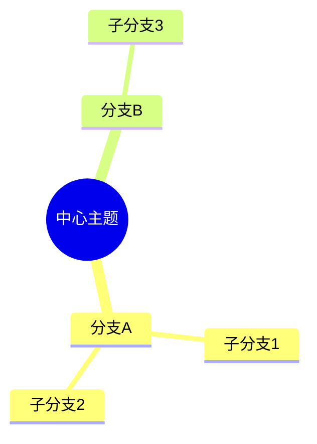

# 高颜值视觉样式模板

> Venngage/Mapify 风格——预设专业配色和布局，导入 XMind 后可直接套用。

## 六大预设主题

### 1. 极简商务 (Minimal Business)
```
XMind 主题设置:
  中心主题: 深蓝 #1B3A5C, 圆角矩形, 白色字
  一级分支: 浅蓝灰 #E3F2FD, 细线连, 深灰字 #333
  二级分支: 白色 #FFF, 浅灰边框 #E0E0E0
  连线: 浅灰 #BDBDBD, 1pt, 圆角
```

### 2. 温暖创意 (Warm Creative)
```
  中心: 暖橙 #FF6F00, 大圆, 白色粗字
  一级: 浅橙 #FFF3E0, 渐细线
  二级: 暖黄 #FFF8E1
  连线: 橙色 #FFB74D, 1.5pt, 曲线
```

### 3. 学术严谨 (Academic)
```
  中心: 深灰 #37474F, 矩形, 衬线字体
  一级: 浅灰 #ECEFF1
  二级: 白 #FFF
  连线: 深灰 #607D8B, 正交线, 直线
```

### 4. 科技深色 (Tech Dark)
```
  中心: 亮青 #00E5FF, 深色底 #1A1A2E
  一级: 暗紫 #16213E, 亮青字
  二级: 深蓝 #0F3460
  连线: 青色 #00E5FF, 1pt, 虚线
```

### 5. 自然清新 (Nature Fresh)
```
  中心: 森林绿 #2E7D32, 大圆角
  一级: 淡绿 #E8F5E9
  二级: 米白 #FFFDE7
  连线: 绿色 #66BB6A, 有机曲线
```

### 6. 奢华暗金 (Luxe Gold)
```
  中心: 暗金 #C79A00, 黑色底 #1A1A1A
  一级: 深灰 #333, 金字
  二级: 暗灰 #222
  连线: 金色 #C79A00, 1.5pt, 粗线
```

## 在 Mermaid 中使用



等价 classDef：
```
classDef business fill:#1B3A5C,color:#fff,stroke:#0D47A1
classDef branch1 fill:#E3F2FD,color:#333,stroke:#BDBDBD
classDef branch2 fill:#FFF,color:#333,stroke:#E0E0E0
```

## 快速套用命令

```bash
# 选择主题生成
python mindmap_to_ppt.py my_mindmap.md -c professional  # 商务
python mindmap_to_ppt.py my_mindmap.md -c creative     # 创意
python mindmap_to_ppt.py my_mindmap.md -c minimal       # 学术
python mindmap_to_ppt.py my_mindmap.md -c ocean         # 科技
```

## 关联

- [Mermaid 流程图](mermaid-flowchart.md) — 颜色语义化
- [Tufte 可视化原则](../methodology/tufte-principles.md) — 设计依据
- [PPT 从导图生成](ppt-from-mindmap.md) — PPT 输出
